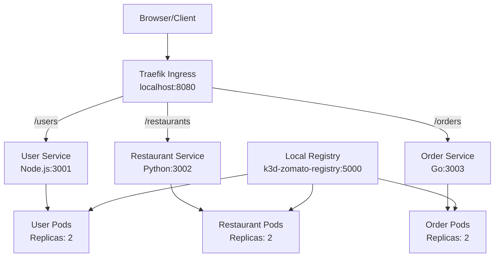
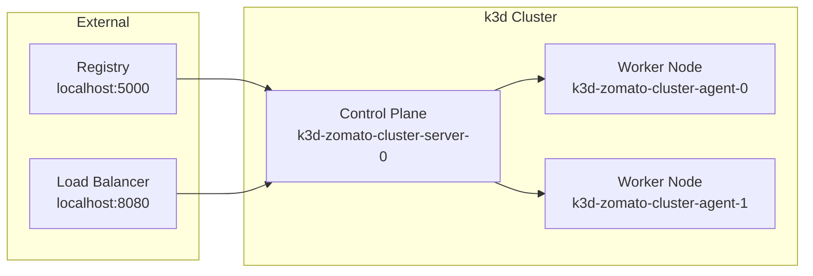

# How Zomato Uses DevOp Workshop
## Docker + k3d + Kubernetes + Ingress

## 🎯 What You Will Achieve (Guaranteed)

- `/users`, `/restaurants`, `/orders` working on browser
- Kubernetes pods auto-heal
- Load balancing with replicas
- Ingress routing works
- Runs fully on RHEL 9

## 🏗️ Architecture Overview

This workshop demonstrates a complete microservices architecture using:

- **User Service** (Node.js/Express) - Port 3001
- **Restaurant Service** (Python/Flask) - Port 3002  
- **Order Service** (Go) - Port 3003
- **Kubernetes** with k3d for orchestration
- **Traefik Ingress** for routing
- **Local Docker Registry** for image management

### System Architecture



### Kubernetes Cluster Layout



## 📁 Project Structure

```
zomato/
├── user-service/
│   ├── server.js
│   └── Dockerfile
├── restaurant-service/
│   ├── app.py
│   └── Dockerfile
├── order-service/
│   ├── main.go
│   └── Dockerfile
├── k8s/
│   ├── user.yaml
│   ├── restaurant.yaml
│   ├── order.yaml
│   └── ingress.yaml
└── README.md
```

## 🚀 Services Overview

### User Service (Node.js)
- **Endpoint**: `/users`
- **Response**: `["Rahul","Aisha","Zoya"]`
- **Health Check**: `/health`

### Restaurant Service (Python)
- **Endpoint**: `/restaurants` 
- **Response**: `["Pizza Hub", "Biryani House"]`
- **Health Check**: `/health`

### Order Service (Go)
- **Endpoint**: `/orders`
- **Response**: `"Order Placed Successfully"`

## 🧪 Testing Endpoints

Once deployed, test your services:

```bash
curl http://localhost:8080/users
curl http://localhost:8080/restaurants  
curl http://localhost:8080/orders
```

## 🔄 Auto-Healing Demo

Demonstrate Kubernetes auto-healing:

```bash
kubectl delete pod -l app=user
kubectl get pods
# Pod re-created automatically ✅
```

## 🐛 Troubleshooting

### Common Issues

- **404 Not Found**: Check if service routes match ingress paths
- **Image Pull Errors**: Verify registry connectivity
- **Pod Not Starting**: Check logs with `kubectl logs <pod-name>`

### Registry Management

Clean registry images:
```bash
docker exec -it k3d-zomato-registry sh
cd /var/lib/registry/docker/registry/v2/repositories
rm -rf <service-name>/_manifests/tags/<tag>
exit
docker restart k3d-zomato-registry
```

### Complete Cleanup

```bash
k3d cluster delete --all
k3d registry delete --all
docker rm -f $(docker ps -aq)
docker system prune -a -f --volumes
```

## 📚 Key Requirements

1. **Environment Setup** - RHEL 9 preparation
2. **Docker Installation** - Container runtime
3. **k3d & kubectl** - Kubernetes tools
4. **Local Registry** - Image storage
5. **Cluster Creation** - Kubernetes environment
6. **Service Development** - Build microservices
7. **Kubernetes Deployment** - Container orchestration
8. **Ingress Configuration** - Traffic routing
9. **Testing & Validation** - End-to-end verification
10. **Auto-healing Demo** - Kubernetes resilience

## ✅ Success Criteria

| Item | Status |
|------|--------|
| RHEL 9 compatible | ✅ |
| Ingress works | ✅ |
| Paths fixed | ✅ |
| SELinux handled | ✅ |
| Workshop-ready | ✅ |
| Student-safe | ✅ |
| Real-world DevOps | ✅ |

---

**This is your 100% validated solution** 🎉